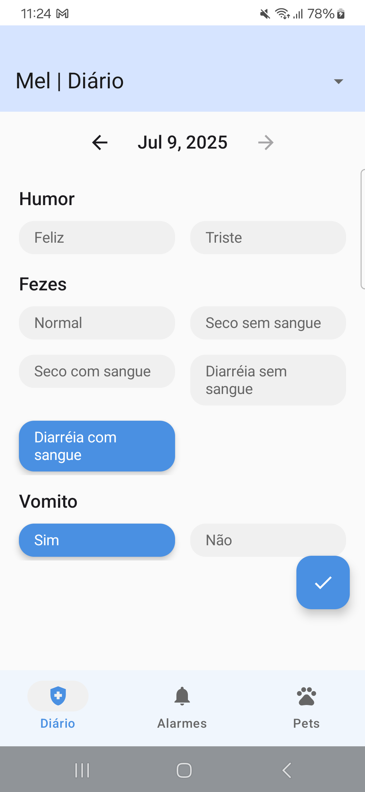
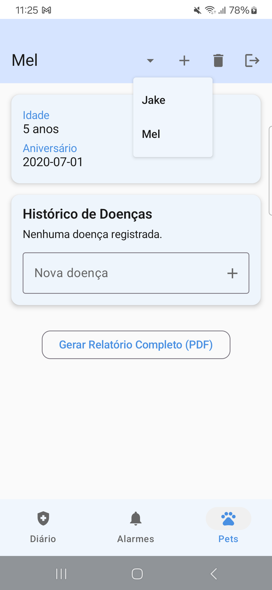
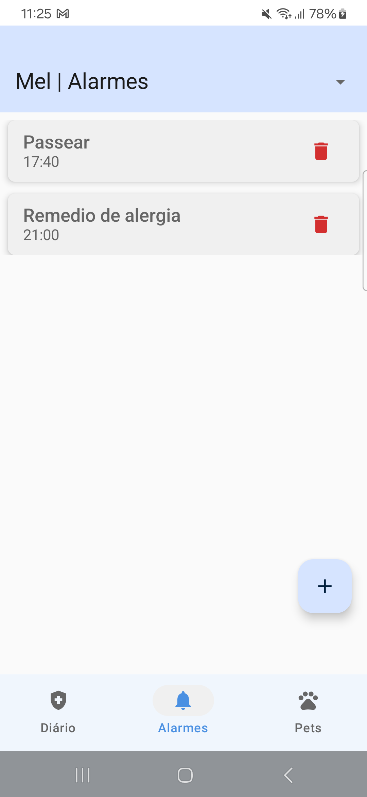

# 🐾 iPet — Intelligent Pet Care Companion

**iPet** is a modern Android application for pet health management. Log symptoms, schedule alarms, and export reports to take better care of your furry companions — all in a clean and intelligent interface built with Jetpack Compose and Firebase.

---

## ✨ Features

- 🐶 **Multiple Pet Profiles** — Manage different pets individually  
- 📆 **Daily Symptom Tracker** — Record health conditions with one tap  
- 🔔 **Alarm Reminders** — Get notified for feeding, medicine, or vet visits  
- 📄 **PDF Report Generator** — Export logs for sharing with your veterinarian  
- 🔐 **Google Sign-In** — Firebase Authentication with secure login  
- ☁️ **Cloud Sync** — All your pet data stored in Firestore  
- 🎨 **Compose UI** — Built with modern Android design standards

---

## 🎥 Demo

👉 [Watch the iPet demo on YouTube Shorts](https://youtube.com/shorts/GqphZI15tfI?feature=share)

> A quick preview of iPet in action — symptom tracking, alarms, PDF export and more!

---

## 📸 Screenshots

| Home | Tracker | Alarm |
|------|---------|-------|
|  |  |  |

---

## 🚀 Tech Stack

| Layer        | Stack                                             |
|--------------|---------------------------------------------------|
| **Language** | Kotlin                                            |
| **UI**       | Jetpack Compose, Material 3                       |
| **Architecture** | MVVM, StateFlow, ViewModel                  |
| **Cloud**    | Firebase Firestore, Firebase Auth, Firebase Storage |
| **PDF**      | Android PdfDocument API                           |
| **Background** | WorkManager, AlarmManager                      |
| **DI**       | Hilt                                              |
| **Navigation** | Jetpack Navigation-Compose                     |

---

## 🔄 Daily Alarm Behavior

Each alarm (e.g. "Deworming") reschedules itself for the next day when triggered.
You can set alarms independently per pet, and they will notify you via the system notification system and reschedule automatically.

## Roadmap

- [x] Per-pet symptom tracking
- [x] Alarm + notification system
- [x] Firebase Auth and Firestore
- [x] PDF report export
- [ ] iOS version via Kotlin Multiplatform
- [ ] In-app calendar view
- [ ] Offline-first Room fallback

